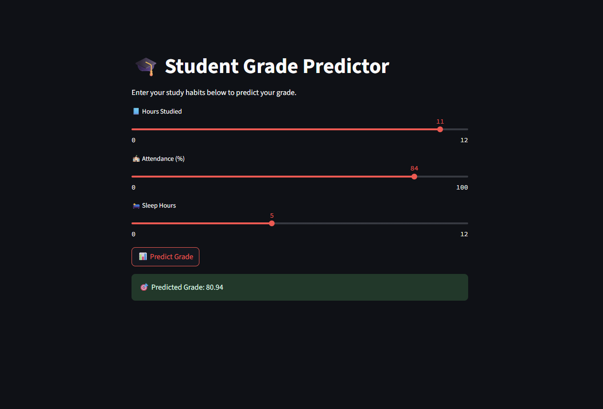

# 📘 Student Performance Predictor

An interactive web app that predicts a student's grade based on their **study hours**, **attendance**, and **sleep hours** using a **Machine Learning model**.  
Built with ❤️ using **Streamlit** and **scikit-learn**.

---

## 📸 App Screenshot



---

## 🚀 Features

- 📊 Predicts student grade based on inputs  
- 🧠 Trained using Linear Regression  
- 🖥️ Clean, beginner-friendly UI (Streamlit)  
- ✅ Works offline — just run and start predicting  

---

## 🏗️ Tech Stack

- Python 🐍  
- Streamlit 🌐  
- scikit-learn 🤖  
- Pandas 📊  
- NumPy 🔢  

---

## 📂 Project Structure

student-performance-predictor/  
├── app.py # Streamlit UI code  
├── train_model.py # Model training script  
├── student_data.csv # Input dataset  
├── model.pkl # Trained model  
├── screenshot.png # App screenshot image  
├── README.md # Project documentation  
└── .gitignore # Ignore unnecessary files  

---

## ▶️ How to Run Locally

### 1. Clone the Repo

```bash
git clone https://github.com/your-username/student-performance-predictor.git
cd student-performance-predictor
